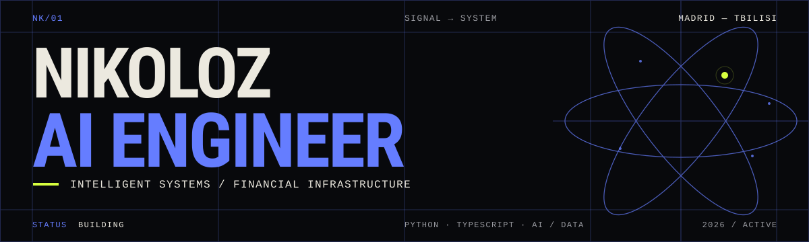

  

### I build intelligent systems that leave the notebook.

Systems with an interface, an operator, and a reason to exist — from agentic workflows and RAG pipelines to data products and financial infrastructure.

 

<strong>CURRENT SIGNAL</strong>

`AGENTIC SYSTEMS` · `RAG PIPELINES` · `DATA / BACKEND` · `FINANCIAL INFRASTRUCTURE`

Madrid ↔ Tbilisi &nbsp;·&nbsp; Computer Science & Artificial Intelligence at IE University

 

## `SELECTED SYSTEMS`

`01` &nbsp; [**BLAZEORM**](https://github.com/KipianiNikoloz/BlazeORM) — Database infrastructure 
`02` &nbsp; [**RINGLEDGER**](https://github.com/KipianiNikoloz/RingLedger) — FinTech · dispute settlement 
`03` &nbsp; [**TRAVELTOM.AI**](https://github.com/gregfu05/TravelTom.ai) — Agentic travel planning · collaborator 
`04` &nbsp; [**TABLEPRO**](https://github.com/KipianiNikoloz/TablePro) — Open-source database tooling 
`05` &nbsp; [**MEMORA**](https://github.com/KipianiNikoloz/Memora) — Intelligent memory systems

 

<strong>OPERATING RANGE</strong>

`PYTHON` · `TYPESCRIPT` · `AI SYSTEMS` · `DATA / BACKEND` · `FINTECH`

 

<strong>COORDINATES</strong>

[**PORTFOLIO**](https://kipianinikoloz.github.io/Portfolio/) ↗ &nbsp;&nbsp;&nbsp; [**LINKEDIN**](https://www.linkedin.com/in/nikoloz-kipiani/) ↗

 

NK/01 · BUILDING FROM SIGNAL TO SYSTEM

